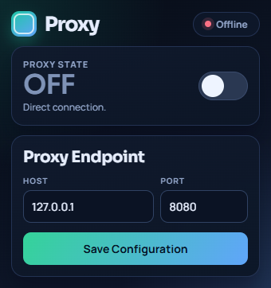

# Proxy

Proxy is a browser extension that lets you quickly route traffic through a local proxy and cleanly disable it when you are done.

  

## Features

- Compact dark popup UI with clear ON/OFF state.
- One-click proxy toggle.
- Configurable host and port (default `127.0.0.1:8080`).
- Settings persist with `chrome.storage.local`.
- Proxy settings are fully cleared when disabled to avoid conflicts with VPN/proxy tools.

## Usage

1. Click the extension icon.
2. Set your proxy host and port.
3. Click **Save Configuration**.
4. Toggle proxy **ON** to route traffic through your configured proxy.
5. Toggle proxy **OFF** to return to direct browsing.

## Changelog

### v1.1.1

- Removed previous branding and renamed UI/app text to `Proxy`.
- Updated popup title/header to `Proxy`.
- Updated `screenshot.png`.

### v1.1.0

- Redesigned popup to a cleaner, simpler dark theme.
- Reduced vertical spacing to remove dead area.
- Improved status copy in the popup.
- Updated `screenshot.png`.

### v1.0.0

- Initial release with configurable host/port and proxy toggle.

## Installation

1. Download or clone this repository.
2. Open `chrome://extensions`.
3. Enable **Developer mode**.
4. Click **Load unpacked** and select this folder.

## License

MIT.