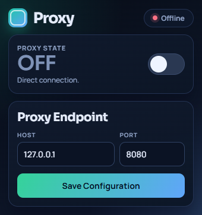

# 🚀 PROXY-EXTENSION

Proxy is a browser extension for bug bounty hunters and pentesters to route browser traffic through a local interception proxy with strict ON/OFF control. Fast toggling, persistent settings, and clean disable behavior in a couple clicks.

  

---
## ✨ Features

### Proxy Controls
- **Quick Toggle** – one-click enable/disable from the popup.
- **Custom Endpoint** – set host and port (default `127.0.0.1:8080`).
- **Persistent Config** – host/port/state stored via `chrome.storage.local`.

### 🧠 Reliable Behavior
- Applies proxy state directly from popup actions with runtime fallback.
- Keeps loopback traffic available with `"<-loopback>"` bypass behavior.
- Fully clears proxy settings when disabled to reduce conflicts with VPN/proxy extensions.

### 🎨 Dark UI (v1.1+)
- Compact dark popup with improved spacing and clearer hierarchy.
- Live status badge and large state indicator (`ON` / `OFF`).
- Cleaner endpoint card with focused Save action.

### âš¡ Workflow
- Set endpoint once and reuse it.
- Enable interception instantly when testing.
- Disable and return to direct browsing immediately.

---
## 🛠️ How to Use

1. Click the extension icon in the browser toolbar.
2. Enter your proxy host and port.
3. Click **Save Configuration**.
4. Toggle the switch to **ON** to route traffic through your proxy.
5. Toggle to **OFF** to clear proxy settings and resume normal browsing.

---
## 🧾 Changelog

### v1.1.5
- Fixed proxy rule conflict in popup apply flow (singleProxy can not be combined with per-protocol rules).
- Restored successful ON toggle behavior in Chromium-based browsers.

### v1.1.4
- Fixed ON-state failures by applying/clearing proxy directly from popup actions.
- Added runtime error handling and safe rollback when proxy apply fails.

### v1.1.3
- Improved extension runtime reliability by simplifying permissions and host access scope.
- Updated background service worker behavior for safer enable/disable handling.

### v1.1.2
- Moved all image assets into the `image/` folder and updated references.
- Refreshed release packaging paths.

### v1.1.1
- Renamed branding and UI text to **Proxy**.
- Updated popup title/header and extension naming.
- Refreshed screenshot.

### v1.1.0
- New compact dark popup UI.
- Better spacing and status readability.
- Updated screenshot.

### v1.0.0
- Initial release with host/port configuration and proxy toggle.

---
## 📦 Installation

1. Download the repo ZIP and unzip.
2. Chrome: `chrome://extensions` → enable **Developer mode** → **Load unpacked** → select the folder.
3. Pin the extension from the toolbar puzzle icon.

---
## 🤝 Contributors

- **Bytes_Knight** — Creator & Maintainer  
  Bugcrowd: [@Bytes_Knight](https://bugcrowd.com/Bytes_Knight)

---
## 🧭 Contributing

1. Fork the repo.
2. Create a branch: `git checkout -b feature/your-feature-name`.
3. Make changes and commit: `git commit -m "Add feature"`.
4. Push: `git push origin feature/your-feature-name`.
5. Open a PR.

---
## 📜 License

MIT.

---

> 🎯 PROXY-EXTENSION — built for hunters and operators.